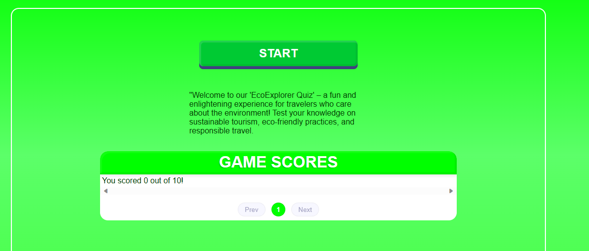

# EcoAdventures

## Description:

EcoAdventures is a webpage with a quiz on sustainable ecotourism where you can push your knowledge to the limits!

## Features:

1. Click Play
2. Answer all the questions
3. See your score

## How to Use:

1. Download the project
2. Install the dependencies
3. Open the terminal and lunch the command "npm run dev"

## Technologies Used:

-React
-TypeScript
-HTML
-CSS

## Author:

This web app was created by [Emanuele Pardini](http://emanuelepardini.altervista.org/).
Enjoy!
